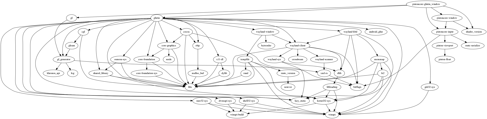

# glutin_window [](https://travis-ci.org/PistonDevelopers/glutin_window) [](https://crates.io/crates/pistoncore-glutin_window) [](https://github.com/PistonDevelopers/glutin_window/blob/master/LICENSE)

A glutin back-end for the Piston game engine

[How to contribute](https://github.com/PistonDevelopers/piston/blob/master/CONTRIBUTING.md)

# Installation
To use this as a dependency, add the following code to your Cargo.toml file:

```Rust
    [dependencies.pistoncore-glutin_window]
    git = "https://github.com/PistonDevelopers/glutin_window"
```

## How to create a window

```Rust
let mut window: GlutinWindow = WindowSettings::new("Glutin Window", (640, 480))
    .fullscreen(false)
    .vsync(true)
    .build()
    .unwrap();
```

See the examples for more ways to create a window.

## Dependencies


